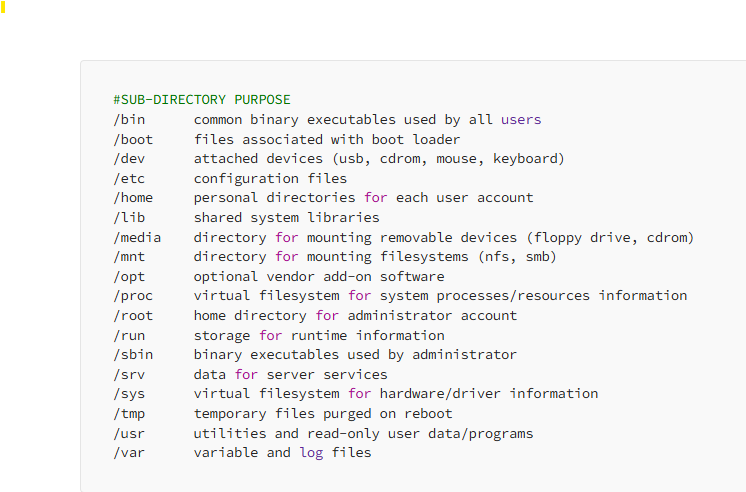

# Linux FileSystem Hierarchy



* The Linux filesystem hierarchy is organized into a tree-like structure starting at the root directory (/). 
* Each directory serves a specific purpose, and understanding it is essential for navigating and managing Linux systems. Here's an overview of the key directories:

### Root(/)

* The top-level directory of the filesystem.
* All other directories branch out from here.
* Only accessible by the root user for administrative tasks.

### Bin(/bin)

* Contains essential user command binaries (programs) needed for system operation.
* Examples:
`ls, cp, mv, cat, grep.`

### Boot(/boot)

* Contains files required to boot the system, such as: The Linux kernel (vmlinuz).
* Bootloader files (e.g., GRUB configurations).
* Example:
`/boot/grub/grub.cfg.`

### Dev(/dev)

* Device files: Special files representing hardware devices (e.g., disks, USBs) and virtual devices.
* Examples: `/dev/sda (hard drive).`

### Etc(/etc)

* Configuration files: System-wide configuration files and scripts.
* Examples:
```
/etc/passwd (user accounts).
/etc/hosts (hostname mappings).
/etc/systemd/system (service files)
/etc/yum.repos.d (repos)
/etc/nginx (Nginx config directory)
```

### Home(/home)

* Contains personal directories for each user.
* Example:
`/home/siva (Siva's home directory).`

### Lib(/lib & /lib64)

* Essential shared libraries needed for binaries in /bin and /sbin.
* Examples:
`/lib/libc.so.6 (C library).`

### Media(/media)

* Removable media: Mount point for external devices (e.g., USB drives, DVDs).
* Example:
`/media/usb.`

### Mnt(/mnt)

* Temporary mount points: Used for mounting filesystems temporarily during maintenance or installation.
* Example:
`/mnt/temp`

### Opt(/opt)

* Optional software: Third-party software packages like tomcat server, prometheus, etc.
* Example:
`/opt/prometheus`

### Proc(/proc)

* Virtual filesystem: Provides system information and kernel data as files.
* Examples:
```
/proc/cpuinfo (CPU details).
/proc/meminfo (memory usage).
```

### Root(/root)

* Root user’s home directory: Personal directory for the root user.
* Example:
`/root/.bashrc`

### Run(/run)

* Runtime files: Stores temporary system information since the last boot.
* Examples:
`/run/utmp (active user sessions)`

### Sbin(/sbin)

* System binaries: Contains administrative commands and utilities used by the root user.
* Examples:
`iptables, reboot.`

### Srv(/srv)

* Service data: Contains files related to specific services (e.g., web servers).
* Example:
`/srv/www (website data)`

### Sys(/sys)

* System information: Interface for accessing and managing kernel-related hardware information.
* Example:
`/sys/class/net (network devices)`

### Swap(/swap)
Used as swap space for virtual memory when RAM is full.

### Tmp(/tmp)

* Temporary files: Stores temporary data; cleared on reboot.
* Examples: Session files, temporary cache.

### Usr (/usr)

* User programs: Contains user applications and utilities.
* Example
```
/usr/bin: Non-essential user commands (e.g., vim, nano).
/usr/sbin: Non-essential system admin commands.
/usr/lib: Libraries for applications in /usr/bin and /usr/sbin.
/usr/local: Locally installed software.
```

### Var(/var)

* Variable data: Files that change frequently.
* Examples:
```
/var/log (log files).
/var/www (web server files).
/var/lib (database files).
/var/lib/docker (docker data)
```
